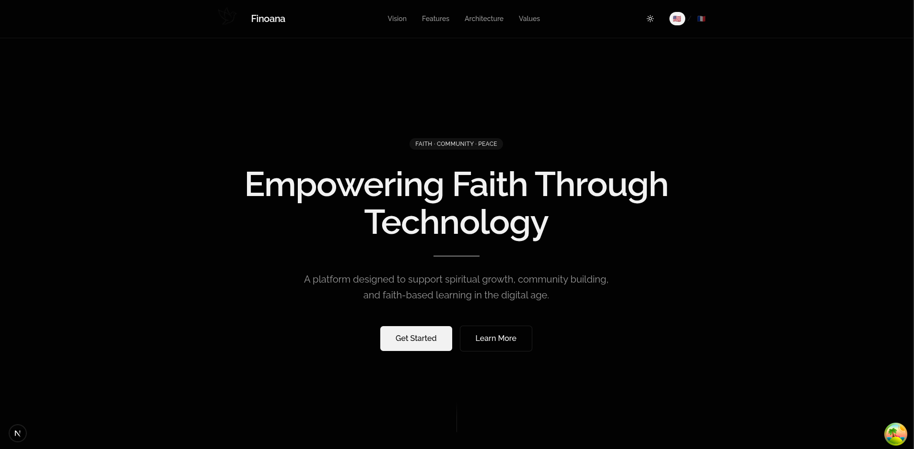
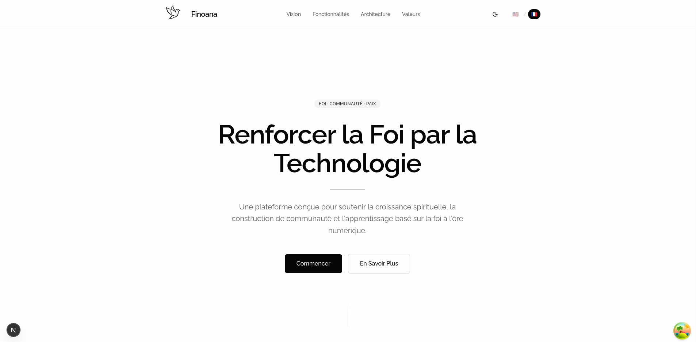

<h1 style="margin-bottom: 20px;">Finoana 🍃</h1>

❝A safe space for faith, prayer, and community❞

  
  
  
  
  
  
  
  
  
  
  

## Preview

  
  

> [!IMPORTANT]
> Finoana is currently under active development and is not yet ready for production use.

> [!NOTE]
> This repository uses a **monorepo architecture** powered by **Turborepo**.
> It hosts multiple applications and shared packages in a single codebase, enabling consistency, reuse, and scalable development.

---

## What is Finoana?

**Finoana** means **"faith"** or **"belief"**.

Finoana is a Christian community platform dedicated to **spiritual sharing, mutual support, collective prayer, and uplifting resources**. The goal is to offer a **peaceful, respectful, and intentional digital space**, free from attention-driven algorithms, where faith and community come first.

---

## Core Features

| Feature                      | Description                                                                                                   | Focus Area           |
| ---------------------------- | ------------------------------------------------------------------------------------------------------------- | -------------------- |
| **Anonymous/Public Prayers** | Share prayers anonymously or publicly, fostering a safe space for personal and communal spiritual expression. | Privacy & Community  |
| **Benedictions Sharing**     | Post and receive blessings, encouragement, or scripture-based benedictions to uplift the community.           | Spiritual Sharing    |
| **Daily Devotions**          | Share personal devotions, reflections, or guided spiritual content with others.                               | Content & Engagement |
| **Daily Bible Verse**        | Automatically display a daily Bible verse with options to reflect, share, or save favorites.                  | Inspiration          |
| **Prayer Circles**           | Create or join prayer groups for collective intercession, with real-time updates and notifications.           | Community            |
| **Spiritual Journal**        | Private space for journaling prayers, reflections, and tracking spiritual growth.                             | Personal Growth      |
| **Encouragement Feed**       | A curated feed of uplifting messages, testimonials, and community support.                                    | Community Engagement |
| **Prayer Requests**          | Submit prayer requests and receive support from the community, with options for private or public visibility. | Support System       |
| **Scripture Highlights**     | Highlight, annotate, and share favorite Bible verses or passages.                                             | Content Sharing      |
| **Faith Challenges**         | Join community challenges (e.g., prayer, fasting, or scripture reading) to grow together in faith.            | Engagement           |
| **Multilingual Support**     | Access content and interact in multiple languages, fostering a global Christian community.                    | Inclusivity          |
| **Minimalist UI**            | Clean, distraction-free design with soothing colors and intuitive navigation for a peaceful experience.       | UX/UI Design         |
| **Privacy Controls**         | Granular settings to control content visibility (public, friends-only, or anonymous).                         | Trust & Safety       |
| **Offline Mode**             | Access saved prayers, devotions, and Bible verses offline for uninterrupted spiritual practice.               | Accessibility        |

---

"Trust in the Lord with all your heart and lean not on your own understanding; in all your ways submit to him, and he will make your paths straight." — Proverbs 3:5-6 (NIV)

